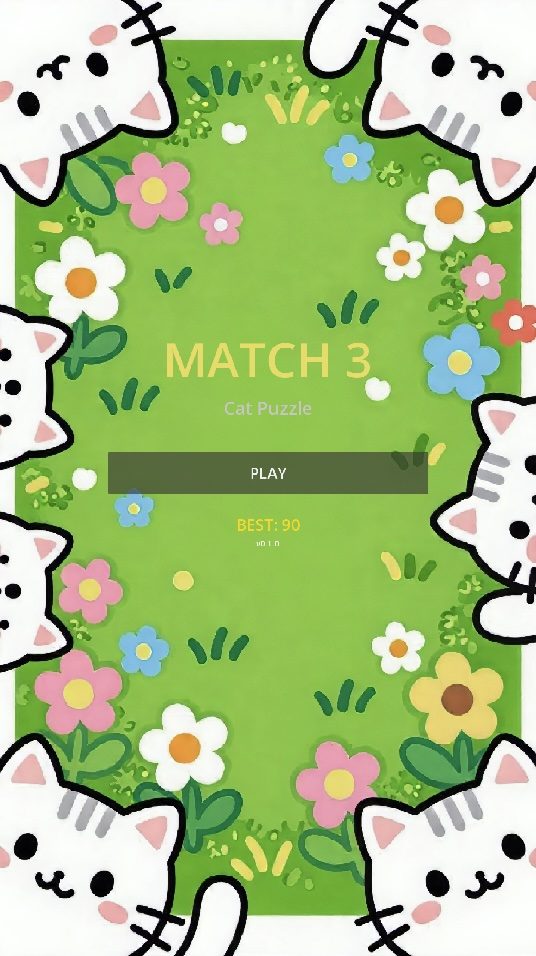
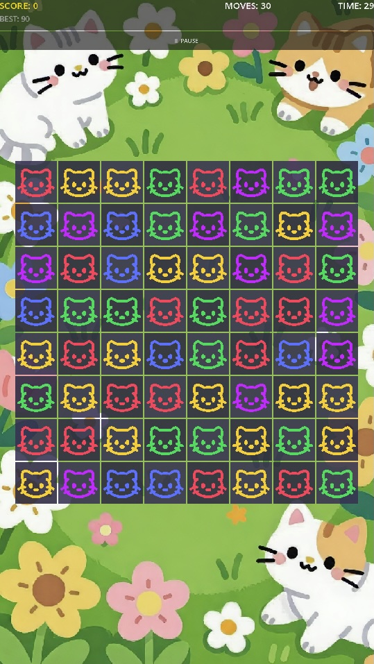
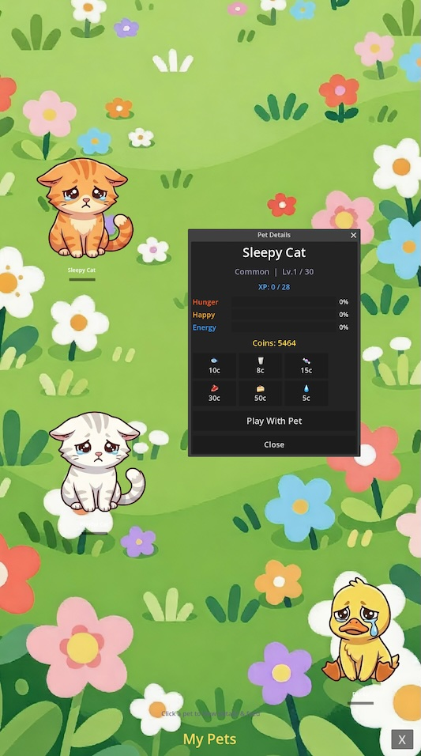
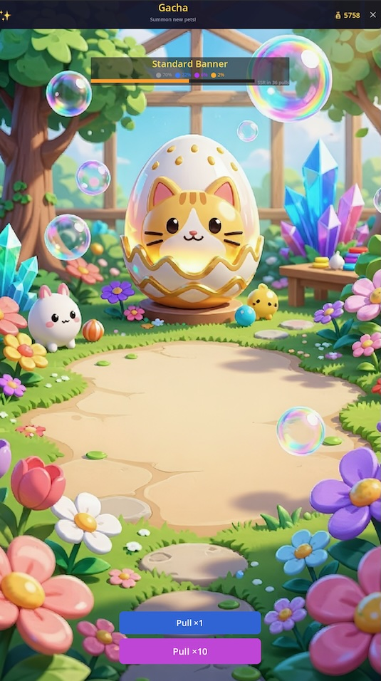

# 🐱 Match-3 Cat Puzzle

> A kawaii cat-themed match-3 puzzle game with pets collection, gacha, cute sound effects, countdown timer, and cascading combos — built with Godot 4.6 .NET + C#

<p align="center">
  
  
  
  
</p>

<p align="center">
  
  
  
  
</p>

---

## ✨ Features

- **8×8 grid** with 5 colorful kawaii cat types (Red, Blue, Green, Yellow, Purple)
- **Click-to-swap** input — tap one tile, then an adjacent one to swap
- **Match-3 detection** with horizontal, vertical, L-shape, T-shape, and Cross patterns
- **Cascading combos** — cleared tiles cause gravity, new tiles spawn, triggering chain reactions
- **Special tiles** — Bomb (4-match), Rainbow (5-match), Cross (L/T shape)
- **Countdown timer** — 30-second time limit, auto game-over when time runs out
- **Cute sound effects** — 16 unique sounds for select, swap, match, clear, cascade, combo, etc.
- **Scoring system** with combo multipliers and floating score popups
- **Animated everything** — swap sliding, clear shrinking, fall bouncing, spawn dropping, screen shake
- **Dynamic board scaling** — automatically fits any window size
- **Pause / Resume** with pause menu
- **Game-over panel** with score display and retry
- **Object-pooled tiles** for performance
- **Pet collection system** — collect adorable hand-drawn pets (cat, dog, bunny, duck), view them in a fullscreen pet room
- **Pet care** — feed & play with pets, monitor hunger/happiness/energy
- **Gacha system** — spend coins to pull for new pets with rarity tiers (Common/Rare/Epic/Legendary)
- **Pity system** — guaranteed rare+ after 70 pulls, legendary at 90
- **Currency economy** — earn coins from gameplay, spend on gacha and pet food

---

## 🎮 How to Play

1. Click **PLAY** on the title screen
2. **Click a cat** to select it (it will grow & glow)
3. **Click an adjacent cat** (up/down/left/right) to swap
4. If the swap makes 3+ in a row → they clear, score up!
5. Tiles fall down, new cats appear → cascade!
6. Beat the **30-second countdown** and get the highest score!
7. Open **GACHA** to spend coins and pull for new pets
8. Visit **PETS** to see your collection, feed & play with them

---

## 🏗 Architecture

```
scripts/
├── autoload/          # Global singletons
│   ├── EventBus.cs    # Signal bus (30+ signals: game + pet + gacha + currency)
│   ├── GameData.cs    # Score, moves, timer, currency, default pet
│   ├── ServiceInitializer.cs  # DI service registry
│   └── AudioManager.cs # SFX object pool (16 sounds)
├── core/              # Pure logic (no engine dependency)
│   ├── BoardData.cs   # 8×8 grid + CellData
│   ├── MatchDetector.cs   # Horizontal/vertical/flood-fill
│   ├── MatchResult.cs     # Match groups + special spawns
│   ├── GravitySystem.cs   # Column-based gravity
│   ├── SpawnSystem.cs     # Random tile filling
│   ├── ScoreCalculator.cs # Score + combo math
│   └── ValidMoveChecker.cs # Deadlock detection
├── game/              # Scene nodes
│   ├── Board.cs           # Grid rendering + input
│   ├── BackgroundLayer.cs # Checkerboard background
│   ├── GameStateMachine.cs # 14-state FSM
│   ├── Tile.cs            # Cat texture display
│   ├── TileManager.cs     # Object pool
│   ├── AnimationController.cs # Tween animations
│   └── Main.cs            # Root scene + countdown timer
├── ui/                # UI screens
│   ├── TitleScreen.cs
│   ├── HUD.cs             # Score, moves, combo, timer, coins
│   ├── PauseMenu.cs
│   ├── GameOverPanel.cs
│   └── FloatingTextSpawner.cs
├── pets/              # Pet system
│   ├── data/              # PetDefinition, ResourcePetDataSource
│   ├── game/              # PetActor (spritesheet + animation), PetLayer
│   ├── models/            # PetInstance, PetNeeds, PetCollection
│   ├── services/          # PetCollectionService, PetCareService
│   └── ui/                # PetShowcase, PetDetailPopup
├── gacha/             # Gacha system
│   ├── data/              # GachaBannerResource, GachaBannerDataSource
│   ├── models/            # GachaBanner, GachaRollResult, GachaPityState
│   ├── services/          # GachaDrawService, GachaRollService, GachaPityTracker
│   └── ui/                # GachaBannerUI, RarityRevealEffect
├── currency/          # Currency system
│   ├── models/            # CurrencyType, CurrencyBalance
│   ├── services/          # CurrencyService
│   └── ui/                # CurrencyDisplay
├── fx/                # Visual effects
│   ├── ParticleController.cs
│   └── ScreenShake.cs
└── utils/
	├── Enums.cs       # GameState, CrystalType, SpecialType, MatchShape
	├── Constants.cs   # Grid size, animation durations
	├── GridUtils.cs   # Coordinate conversion + dynamic layout
	├── IDataSource.cs    # Generic data source interface
	└── IPersistentStorage.cs  # Save/load interface
```

---

## 🧪 Tests

10 xUnit test files (41 tests) covering core logic:

| File | Tests |
|------|-------|
| `Tests/BoardDataTests.cs` | Index conversion, swap, bounds, clear |
| `Tests/BoardGenerationTests.cs` | No-match generation, all-cells-filled |
| `Tests/MatchDetectorTests.cs` | Horizontal/vertical/l-shape/no-match |
| `Tests/GravitySystemTests.cs` | Single/multiple/no falls, empty column |
| `Tests/ScoreCalculatorTests.cs` | Line scores, combos |
| `Tests/SpecialTilesTests.cs` | Bomb, rainbow, cross spawns |
| `Tests/ValidMoveCheckerTests.cs` | Valid move detection |
| `Tests/EdgeCasesTests.cs` | Cascade protection, empty board |
| `Tests/ReshuffleTests.cs` | Reshuffle logic |
| `Tests/SwapClearCascadeTests.cs` | Full swap→clear→gravity→spawn cycle |

```bash
dotnet build   # compile (0 errors, 0 warnings)
dotnet test    # run tests (requires .NET 8 runtime)
```

---

## 🚀 Getting Started

### Prerequisites
- **Godot 4.6 .NET edition** ([download](https://godotengine.org/download/))
- **.NET 8.0 SDK** (included with Godot .NET, or install separately)

### Open the project
1. Clone this repo
2. Open **Godot .NET** editor
3. Click **Import** → select the `project.godot` file
4. Wait for C# compilation (first time takes ~30s)
5. Press **F5** to run

### Run tests
```bash
dotnet build
dotnet test
```

---

## 🎨 Asset Credits

- **Cat SVGs** — custom-designed vector graphics in `assets/textures/cats/`
- **Pet spritesheets** — hand-drawn 1024×1024 3×3 expression grids in `assets/textures/pets/`
- **Sound effects** — procedural cute synth sounds in `assets/audio/`
- **Background images** — `assets/images/`

---

## 📄 License

MIT — feel free to use, modify, and share!
